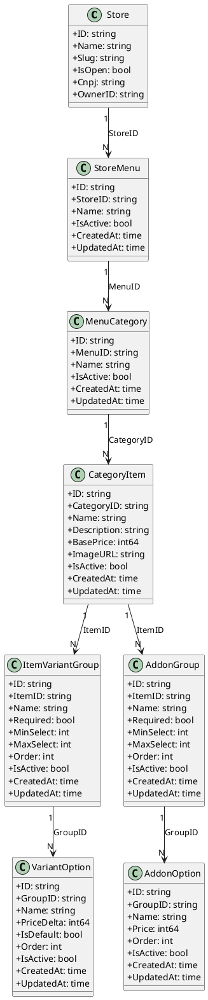

# 🍽️ SaaS Core — Backend (Go + Gin)

Backend core de um sistema de **marketplace de restaurantes + gestão de cardápio**, inspirado em plataformas como **Menudino / AnotaAi**.

O projeto foi pensado desde o início para:

- separar bem domínio, aplicação e infraestrutura
- suportar **usuários comuns** e **donos de loja**
- permitir **cardápios altamente configuráveis**
- escalar futuramente (ex: CassandraDB, pedidos, pagamentos)

---

## 🎯 Objetivo do Projeto

Criar um backend sólido para:

- cadastro e autenticação de usuários
- criação e gestão de lojas
- criação de cardápios por loja
- estrutura pronta para categorias, itens, variações e adicionais
- tomada de decisão de fluxo já no login (UX simples para o front)

---

## 🏗️ Arquitetura

Arquitetura baseada em **Clean Architecture / Hexagonal**:

```

cmd/api → Entrypoint da aplicação
internal/domain → Domínio puro (entities, regras)
internal/usecase → Casos de uso (regras de aplicação)
internal/infra → HTTP, middleware, repos in-memory
internal/port → Interfaces (ports)
pkg → Infra técnica (jwt, password, uuid)

```

### Princípios

- Domínio não conhece HTTP nem banco
- Usecases orquestram regras de negócio
- Infra apenas implementa contratos
- Fácil troca de persistência (ex: CassandraDB)

---

## 🔐 Autenticação & Sessões

- Autenticação via **JWT (HS256)**
- JWT possui `jti` (ID único do token)
- Sessões são **stateful**
- Cada login gera uma sessão persistida em repositório

### Middleware de autenticação valida:

- Header `Authorization`
- JWT válido
- Sessão existente
- Expiração do token

### Claims do JWT

- `user_id`
- `role` (uso interno)
- `exp`, `iat`, `iss`, `jti`

---

## 👤 Tipos de Usuário e Fluxos

O sistema trabalha com **dois tipos de usuários**, sem expor roles internas ao frontend.

### Entrada no cadastro (`POST /user`)

```json
{
  "user_type": "customer" | "store"
}
```

### Tipos

- **customer** → usuário comum (faz pedidos)
- **store** → usuário que irá criar e gerenciar loja

---

## 🔁 Fluxo de Login (Opção A)

No login, o backend já decide **para onde o usuário deve ir**.

### `POST /login` → Response

```json
{
  "token": "jwt...",
  "user": {
    "id": "u1",
    "name": "Fulano",
    "kind": "store"
  },
  "stores_count": 0,
  "next_step": "CREATE_STORE"
}
```

### Possíveis `next_step`

- `BROWSE_STORES` → usuário comum
- `CREATE_STORE` → dono sem loja
- `STORE_DASHBOARD` → dono com loja(s)

### Regra de decisão

```
if kind == customer:
  BROWSE_STORES
else if kind == store and stores_count == 0:
  CREATE_STORE
else:
  STORE_DASHBOARD
```

---

## 🧭 Diagrama do Fluxo de Onboarding

```
┌─────────────────────────┐
│  SIGNUP (POST /user)    │
│  user_type              │
└────────────┬────────────┘
             │
             ▼
┌─────────────────────────┐
│   LOGIN (POST /login)   │
│ token + next_step       │
└────────────┬────────────┘
             │
             ▼
┌────────────────────────────────────────┐
│ Backend decide next_step               │
│                                        │
│ customer → BROWSE_STORES               │
│ store + 0 lojas → CREATE_STORE         │
│ store + lojas → STORE_DASHBOARD        │
└────────────┬───────────────────────────┘
             │
     ┌───────┼────────────┐
     ▼       ▼            ▼
┌────────┐ ┌──────────┐ ┌─────────────────┐
│Browse  │ │Create    │ │Store Dashboard  │
│Stores  │ │Store     │ │Menus / Gestão   │
└────────┘ └──────────┘ └─────────────────┘
```

---

## 🏪 Domínio de Loja

### Store

- pertence a um usuário (Owner)
- um usuário pode ter **0 ou mais lojas**
- apenas usuários autenticados podem criar loja

---

## 🍽️ Domínio de Cardápio (Detalhado)

O cardápio foi projetado para suportar **produtos complexos**, como pizzas, combos, adicionais e variações.

### Hierarquia Conceitual

```
Store
 └── Menu
      └── MenuCategory
           └── CategoryItem
                ├── ItemVariantGroup
                │     └── VariantOption
                └── AddonGroup
                      └── AddonOption
```

### Responsabilidade de cada entidade

- **Menu**
  - Cardápio principal de uma loja

- **MenuCategory**
  - Agrupa itens (ex: Pizzas, Bebidas)

- **CategoryItem**
  - Produto final (ex: Pizza Calabresa)

- **ItemVariantGroup**
  - Grupo de variações (ex: Tamanho)

- **VariantOption**
  - Opção da variação (ex: Grande +R$10)

- **AddonGroup**
  - Grupo de adicionais (ex: Adicionais)

- **AddonOption**
  - Adicional selecionável (ex: Bacon +R$5)

---

## 💰 Regra de Preço

```
Preço final =
Item.BasePrice
+ soma(VariantOption.PriceDelta)
+ soma(AddonOption.Price * quantidade)
```

- Variações alteram o preço via `PriceDelta`
- Adicionais somam preço fixo por unidade

---

## 📐 UML — Relacionamento das Entidades de Cardápio

> PlantUML — pode ser colado em qualquer viewer compatível



---

## 🌐 Rotas da API (Atual)

### Públicas

- `POST /user` → cria usuário
- `POST /login` → login (retorna token + next_step)

### Protegidas (JWT)

#### Store

- `POST /store`
- `GET /store/id/:id`

#### Store Menu

- `POST /store/:storeId/menu`
- `GET /store/:storeId/menus`
- `GET /menu/:id`

#### User

- `GET /user/:id`
- `GET /user/email/:email`
- `GET /user/cpf/:cpf`

#### Menu Category

- `POST /menu/:menuId/category`
- `GET /menu/categories/:menuId`
- `GET /menu/category/:id`

#### Category Item

- `POST /menu/category/:categoryId/item`
- `GET /menu/category/item/:id`
- `GET /menu/category/items/:categoryId`

#### Item Addon Group

- `POST /item/:categoryItemId/addon-group`
- `GET /item/addon-group/:id`
- `GET /item/:categoryItemId/addon-groups`

#### Addon Option

- `POST /addon-group/:itemAddonGroupId/addon-option`
- `GET /addon-option/:id`
- `GET /addon-group/:itemAddonGroupId/addon-options`

#### Item Variant Group

- `POST /item/:categoryItemId/variant-group`
- `GET /item/variant-group/:id`
- `GET /item/:categoryItemId/variant-groups`

#### Variant Option

- `POST /variant-group/:itemVariantGroupId/variant-option`
- `GET /variant-option/:id`
- `GET /variant-group/:itemVariantGroupId/variant-options`

#### Order / Cart (Carrinho & Pedido)

- `POST /store/:storeId/order` → cria ou retorna o carrinho (draft) **único** (status `CREATED`)
- `POST /order/:orderId/item` → adiciona item ao pedido (com **merge automático** se mesma combinação)
- `GET /order/:orderId` → retorna o pedido/carrinho atual (itens + totals)
- `PATCH /order/:orderId/item/:itemId` → atualiza quantidade de um item do pedido (**itemId = OrderItem.ID**)
- `DELETE /order/:orderId/item/:itemId` → remove item do pedido (**itemId = OrderItem.ID**)
- `PATCH /order/:orderId/place` → fecha o pedido (status `PLACED`) e libera o carrinho único para criar outro

#### Payments (Mock)

> Pagamento simulado para desenvolvimento. Valor é sempre calculado no backend usando `order.Total`.

- `POST /order/:orderId/payments` → cria tentativa de pagamento (mock) para um pedido `PLACED`
- `GET /payments/:paymentId` → consulta status do pagamento
- `POST /payments/:paymentId/confirm` → simula pagamento confirmado (status `PAID`) e marca pedido como `PAID`
- `POST /payments/:paymentId/fail` → simula falha no pagamento (status `FAILED`)

---

## 🗄️ Persistência (Atual)

- Repositórios **in-memory**
- Estrutura preparada para CassandraDB
- Índices simulados:
  - `byID`
  - `byOwner`
  - `byStore`
  - `byMenu`
  - `byCategory`
  - `byItem`

---

## 🧪 Testes

- Value Objects:
  - CPF
  - CNPJ

- Password hash (bcrypt)

---

## 🛣️ Próximos Passos Planejados

### ✅ Já Implementado (MVP até aqui)

- Categorias do menu
- Itens do menu
- Variações de itens
- Adicionais
- Pedido / Carrinho (draft único por user+store)
- Edição de carrinho (GET, update qty, remove item)
- Place order (status `PLACED`)
- Pagamento (MOCK) com confirmação/falha e transição do pedido para `PAID`

### 🔜 Próximos passos (prioridade)

1) **GET MenuFull (essencial pro front)**
   - Endpoint que retorna `menu -> categorias -> itens -> variantGroups/options -> addonGroups/options`

2) **Checkout & Entrega (dados de entrega e cálculo de taxas)**
   - endereço / retirada / observações
   - taxas de entrega/serviço (backend calcula)
   - regras por loja (mínimo, raio, horários)

3) **Persistência real**
   - migrar de repos in-memory para banco (ex: Postgres primeiro; Cassandra depois se fizer sentido)
   - manter contratos (ports) para troca sem refatoração grande

4) **Pagamentos reais (provider)**
   - integrar Mercado Pago / Asaas
   - webhook assinado
   - idempotência e retry
   - reconciliação de status (pedido x pagamento)

5) **Pedidos da loja (painel do lojista)**
   - listar pedidos por store
   - status de preparo/entrega
   - cancelamento e reembolso (futuro)

6) **Observabilidade**
   - logs estruturados
   - tracing básico
   - métricas (latência, erros por rota, conversão de checkout)

## 🧑‍💻 Status do Projeto

🚧 Em desenvolvimento ativo
🧠 Arquitetura definida
🔐 Autenticação sólida
🍽️ Base de cardápio pronta para evoluir

---

## Como rodar a aplicação

```bash
docker compose up
```

---

## Como rodar os testes

```bash
docker compose exec api go test -v ./...
```
